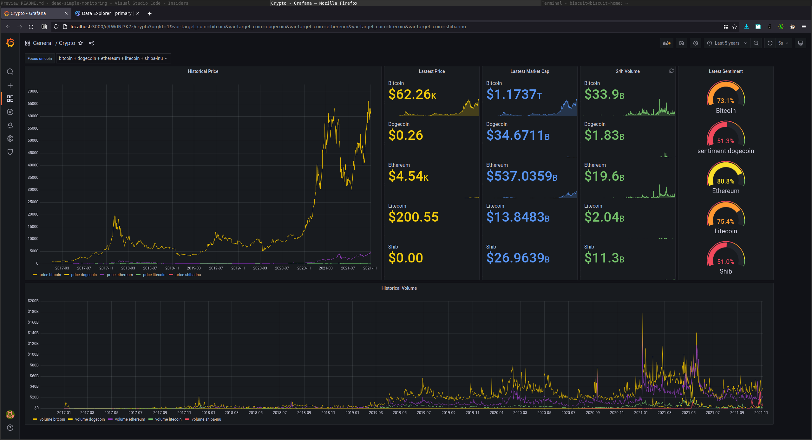
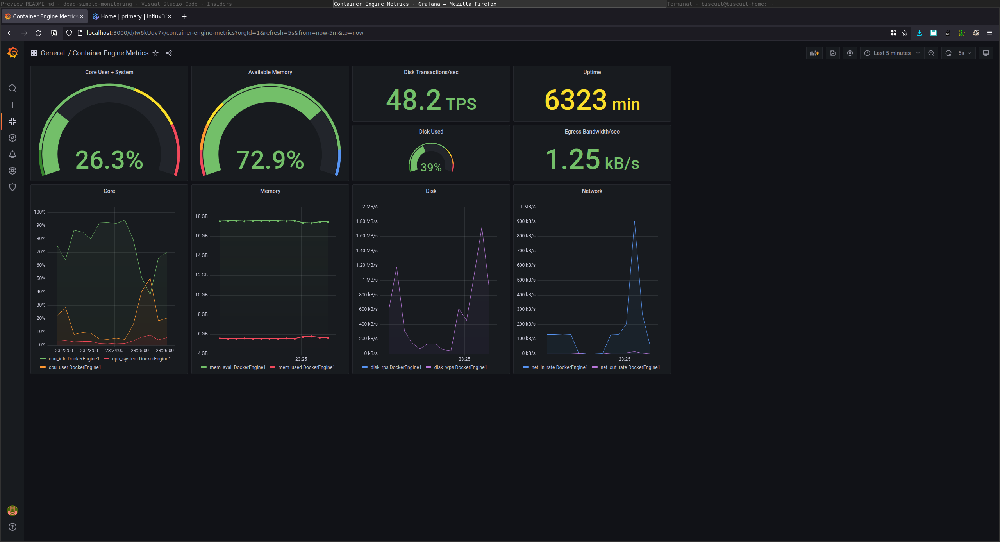

# dead-simple-monitoring

## What is this??

Super basic monitoring suite with Influx and Grafana. Packaged with docker-compose.

This tool lets you track *just about **anything***. Examples include:

- Application / cloud infra load metrics.
- Cryptocurrency, stock markets, IoT, sensors.
- Anything that *fits* into influx, it tracks!

To run the comprehensive example (warning: may slow your cpu for 5 mins), Clone or download this project, install [Docker Desktop](https://docs.docker.com/desktop/), navigate to this folder (in terminal), and run:

`./scripts/demo.sh`

The demo consists of

- Influx
- Grafana
- Crypto exporter writing to influx
- Sysinfo exporter writing to influx

Dashboards are provisioned under `deploy/compose-[env]/grafana/provisioning`

To see the dashboard in action, navigate to `http://localhost:3000`. The logins are:

User: `admin`
Pass: `deadsimple`

To learn how to add coins to the crypto dashboard, click [here](Coins.md).

----

If you find this useful, feel free to tip a few DogElon Mars (ELON) @ `0x4a865b322bf9f243b59957ff0930259beccdc6c8`

## Screenshots

### Crypto

### Sysinfo

Tested on Linux and macOS.
